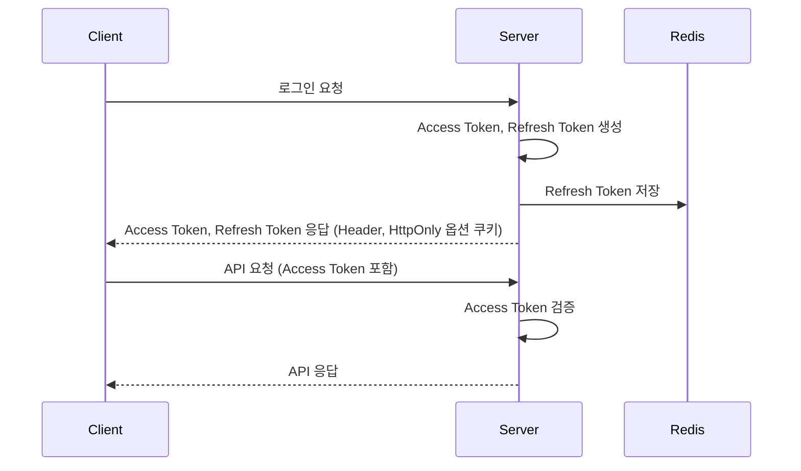
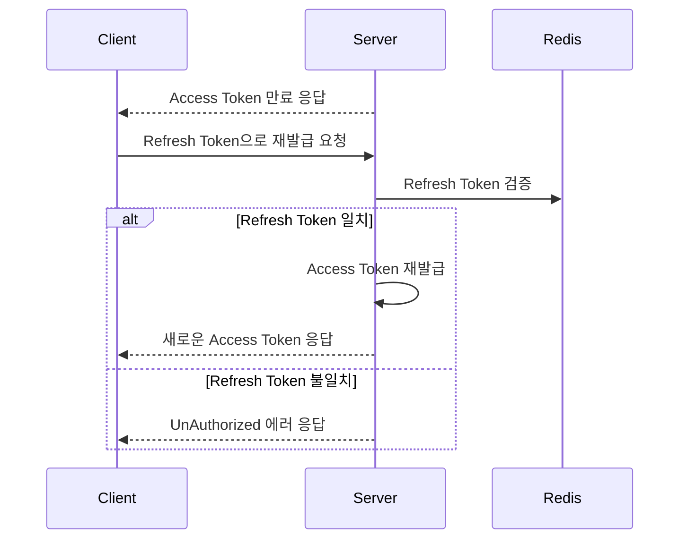
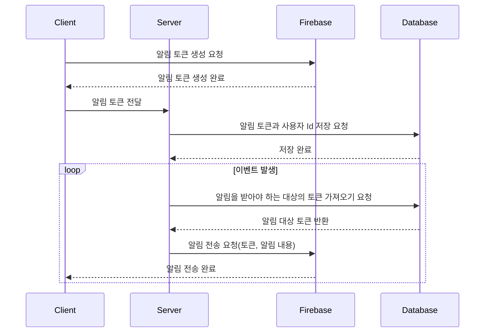
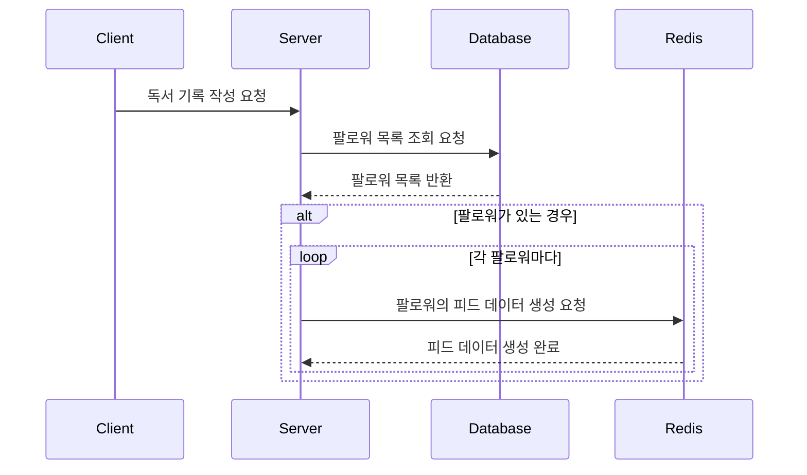
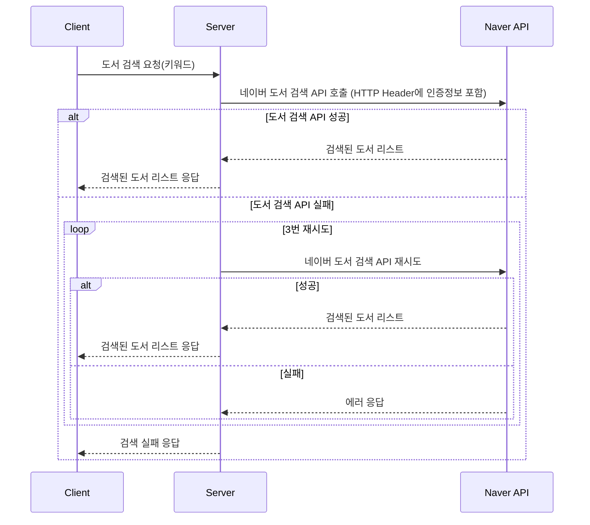
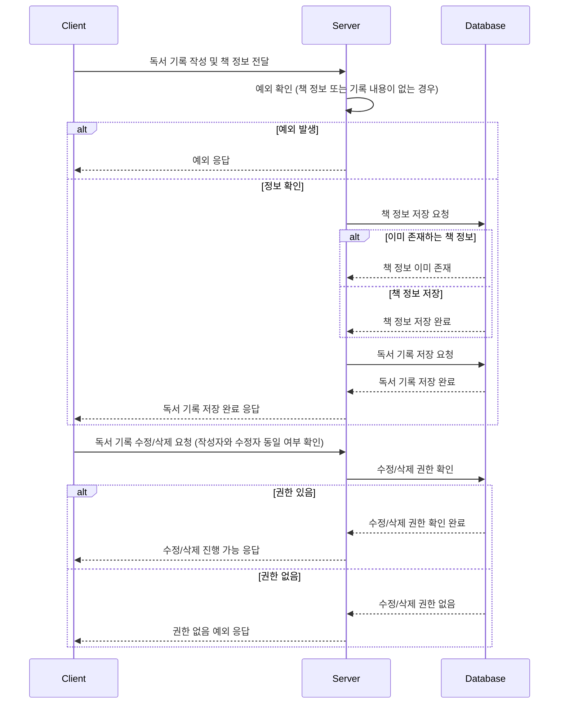
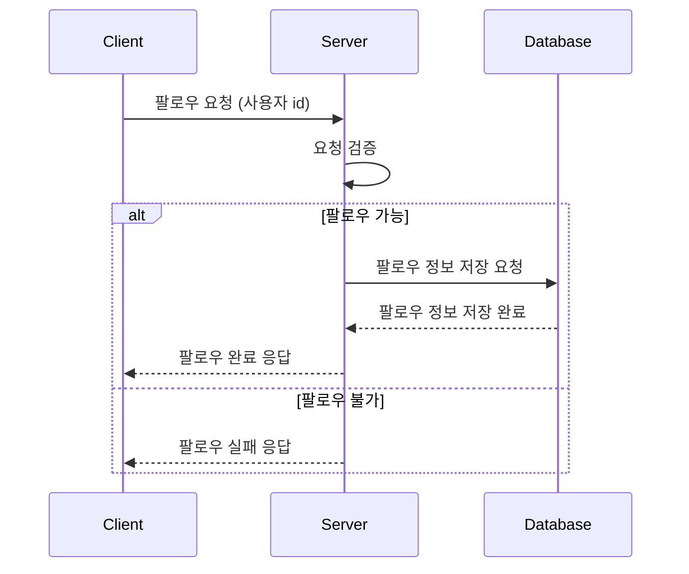
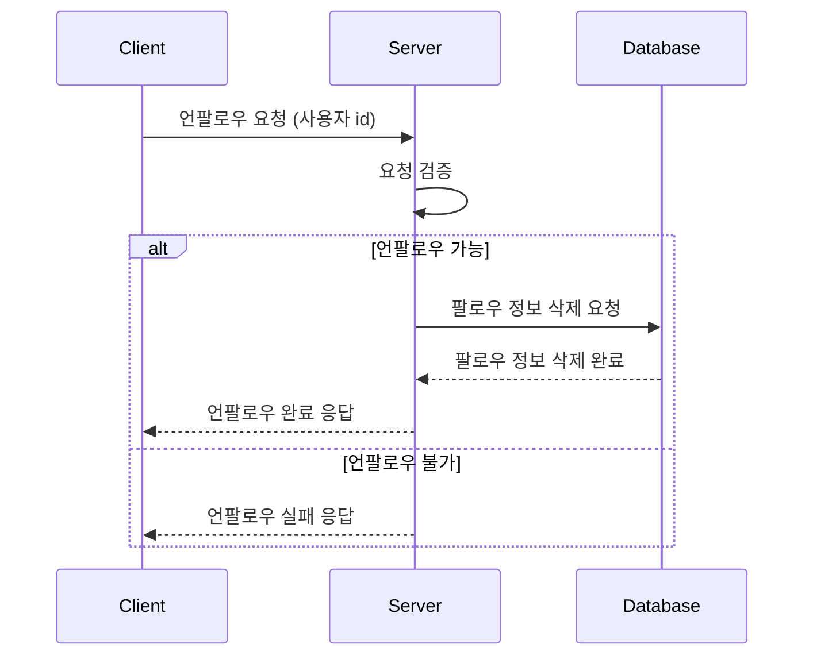

# ReadNShare
독서 기록 및 공유 서비스

# **요약 (Summary)**

이 프로젝트는 독서 기록 및 공유 서비스를 만드는 것으로, 
사용자는 회원 가입 후 독서 기록을 작성하고 팔로우 하고 있는 다른 사용자들의 기록을 조회할 수 있습니다.

특정 사용자에 대한 팔로우, 언팔로우가 가능하며 다른 사용자가 팔로우 하는 경우 이에 대한 알림을 받을 수 있습니다.

# **배경 (Background)**

많은 독서 애호가들이 독서 경험을 공유하고 다른 사람들의 추천을 받고 싶어하는데, 이를 위한 플랫폼이 부족하다고 생각했습니다. 

따라서 독서 커뮤니티를 구축하여 사용자들이 서로의 독서 경험을 나누고 소통할 수 있는 공간을 제공하고자 합니다.

# **목표 (Goals)**

독서 경험 공유를 위한 플랫폼에 필요한 간단한 핵심 기능들의 구현을 목표로 삼고 있습니다.

1. 안정적이고 확장 가능한 독서 기록 및 공유 서비스 구현
    1. 유지보수와 확장이 용이한 코드를 작성
    2. 객체지향 프로그래밍 원리에 대한 학습
    3. 단위 테스트를 통해 코드의 안정성을 확보
    
2. CI/CD를 통한 자동화된 빌드 및 배포 과정을 구축하여 원활한 협업 배경에 대한 이해

# **목표가 아닌 것 (Non-goals)**

시간 관계 상 구현까지는 못했으나, 관련 개념에 대해 공부하고 정리하였습니다.

1. Refresh Token 탈취 대응 (RTR 기법)
2. 인플루언서 피드 발행 시 pull모델 적용(push + pull 모델 혼합 적용)
3. 다양한 형태의 피드 생성 (NoSQL 적용)
4. 적절한 캐싱전략
5. 멀티 그레들 모듈을 이용한 코드 의존성 관리
6. DDD 적용

# **계획 (Plan)**

### 시스템 아키텍처
(+비용 문제로 실제 클라우드 환경에서는 Redis, MySQL은 한 대씩 떠있습니다. 추구하는 방향의 아키텍처라고 생각해주세요.)

### 사용 기술 스택

- Java 17, Spring Boot 3.2.2, Gradle, Spring Data JPA
- MySQL, Redis
- Firebase Admin SDK
- JUnit5, Mockito
- Github Action, Docker
- Jmeter, Prometheus, Grafana

### 기술 상세

로그인 기능

1. 로그인 성공 후 서버에서 Access Token, Refresh Token 생성, Refresh Token은 Redis에 저장한다.
    1. 생성된 Access Token은 Header로 응답 받음
    2. 생성된 Refresh Token은 HttpOnly 옵션 쿠키로 응답 받음

2. 이후 클라이언트에서 API 요청 시 서버에서 Access Token을 검증한다.
   1. Access Token 만료 시 클라이언트에 만료 응답 보냄 (Refresh Token 보낼 것을 요청)
   2. 클라이언트에서 만료 응답 받은 후 Refresh Token으로 서버에 재발급 요청
   3. 서버에서 Refresh Token 받은 후 확인하여 검증
   4. Refresh Token 일치하면 Access Token 재발급, 일치하지 않는다면 에러 발생

인증 플로우

갱신 플로우

알림 기능(다른 사용자가 나를 팔로우 할 때  알림)

1. Firebase SDK를 이용하여 알림 토큰을 생성한다. (이 토큰은 해당 기기를 식별하는 고유한 값으로, 알림을 받을 대상을 나타낸다.)
2. 클라이언트는 생성된 알림 토큰을 서버로 전달한다.
3. 서버는 전달 받은 토큰과 클라이언트의 사용자 Id를 함께 데이터베이스에 저장한다.   
    (어떤 사용자에게 알림을 보내야 하는지 식별 가능하다.)
4. 서버에서 특정 이벤트가 발생하면, 알림을 받아야 하는 대상의 토큰을 데이터베이스에서 가져온다.
5. 서버는 가져온 알림 토큰과 전송할 알림 내용을 Firebase에 전달한다.
6. Firebase는 받은 토큰에 해당하는 클라이언트에 알림을 전송한다.

피드 기능

   - Fan Out On Write, Push 모델
1. 독서 기록 작성 시 팔로워(나를 팔로우 하고 있는 사용자) 목록을 조회한다.
2. 조회 된 팔로워가 있을 경우 팔로워의 피드 데이터를 생성한다.
    1. Redis sorted set을 이용
    2. key는 follower의 id, value는 피드에 보여져야 하는 독서 기록 정보
3. 팔로워가 피드 조회 시에는 Redis에서 본인(팔로워) Id로 검색 후 생성되어 있는 데이터를 조회할 수 있다.

도서 검색 기능

- 네이버의 도서 검색 오픈API 이용하여 구현
    - 인증정보 발급 받아 API 호출 시 HTTP 헤더에 포함 후 전송해야 한다.
    1. 클라이언트에서 검색 키워드로 도서를 검색한다.
    2. 도서 검색 API 호출 실패 시 3번까지 요청 재 시도한다.
        1. 재 시도 성공 시 검색된 도서 리스트를 응답한다.
        2. 재 시도 실패 시 검색 실패 에러를 응답한다.
    3. 서버에서 API 호출 성공 시 검색된 도서 리스트를 응답한다.

독서 기록 등록/수정/삭제 기능

1. 클라이언트에서 독서 기록을 작성한 후 기록 내용과 책 정보를 서버에 전달한다.
2. 서버에서 독서 기록을 저장한다.
    1. 책 정보나 기록 내용이 존재하지 않는 경우 예외가 발생한다.
    2. 독서 기록을 저장하기 전 책 정보 먼저 Book 테이블에 저장한다.
    3. 동일한 ISBN 값으로 Book 테이블에 이미 책 정보가 존재하는 경우에는 저장하지 않는다.
    4. Review 테이블에 독서 기록을 저장한다.
3. 독서 기록을 수정/삭제 하려는 경우에는 작성자와 수정자가 같아야 한다.

팔로우/언팔로우 기능

- 팔로우
1. 클라이언트에서 팔로우 할 사용자의 id(이메일)를 서버에 전달한다.
2. 서버에서 검증 후 팔로우 정보를 저장한다.
    1. 자기 자신을 팔로우 하려는 경우 예외가 발생한다.
    2. 동일한 사용자를 반복해서 팔로우 하려는 경우 예외가 발생한다.
    3. 존재하지 않는 회원을 팔로우 하려는 경우 예외가 발생한다.
    
- 언팔로우
1. 클라이언트에서 언팔로우 할 사용자의 id(이메일)를 서버에 전달한다.
2. 서버에서 검증 후 팔로우 정보를 삭제한다.
    1. 팔로우 정보가 있는 경우에만 삭제한다.
    2. 존재하지 않는 회원을 언팔로우 하려는 경우 예외가 발생한다.

